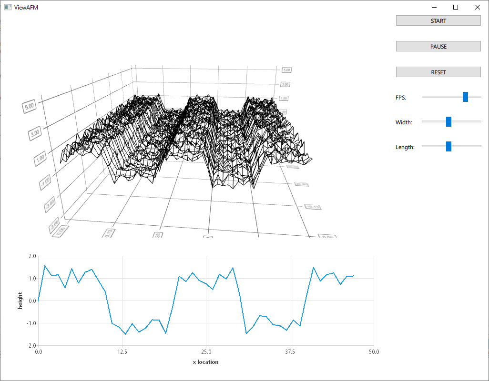

# ViewAFM
A simple AFM surface data viewer (Qt/QML). The application simulates a stream of height data, just like from a real AFM. The simulation implements a simple state machine, that allows the user to start, stop, and reset the surface measurement, as well as modify some relevant parameters. The height data is then displayed: in a line plot, and in a 3D surface plot.

The 1D data visualization is implemented via a QtCharts `LineSeries` within a `ChartView`. The 3D plot is a `Surface3D` component from the QtDataVisualization module.

The user interface is purely done in QML. The `Simulation` class (a singleton) is exposed to the QML engine and handles most of the logic. It also holds an instance of a `DataGenerator`, which streams height data when requested. The height data is handled by the `DataSource` class, which acts (sort-of) as the controller in a MVC setup.

## Example

